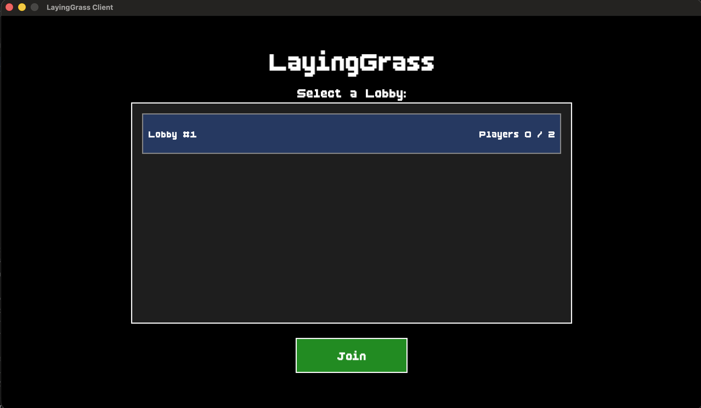
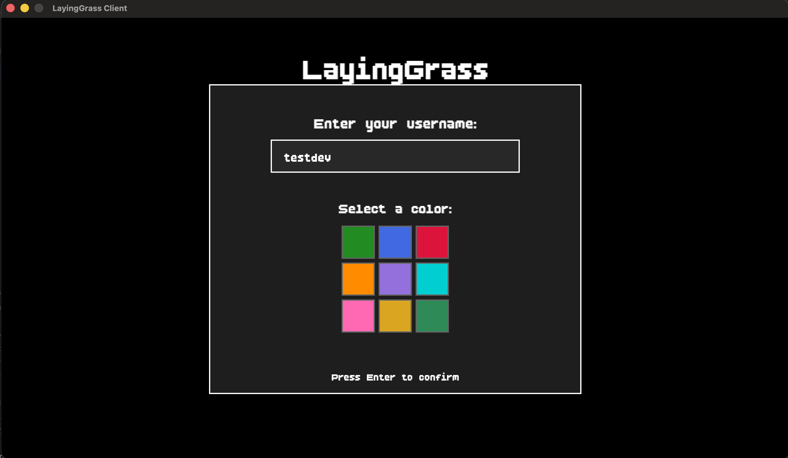
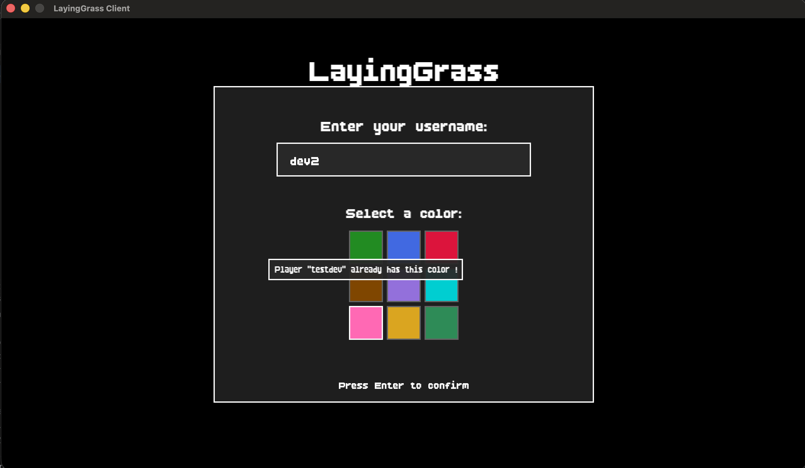
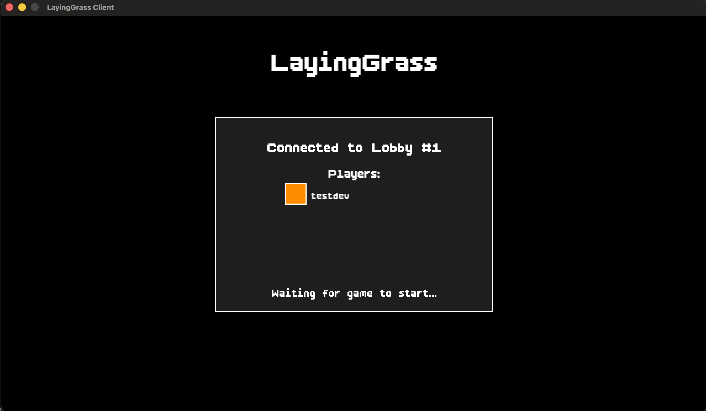
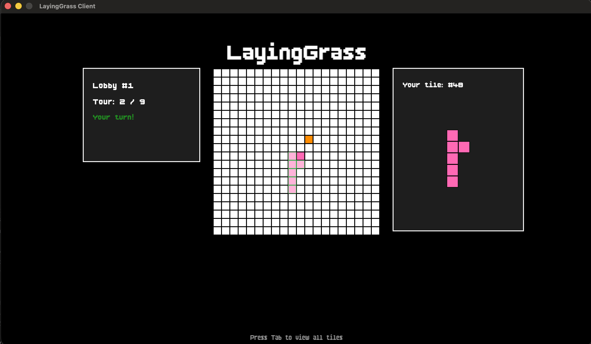
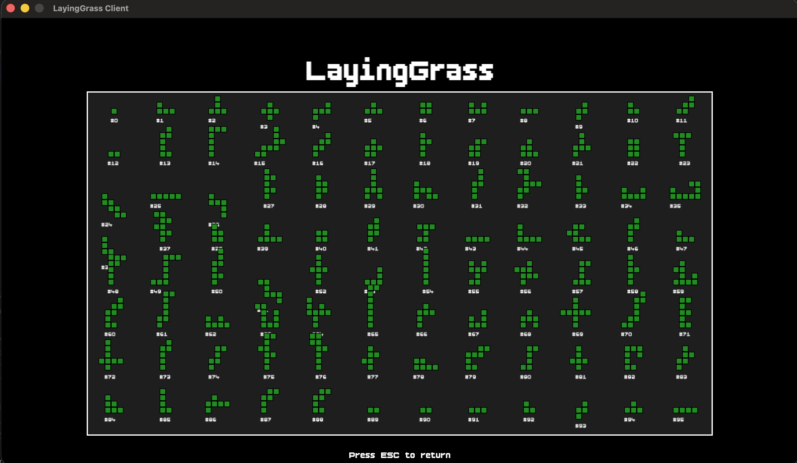

# LayingGrass

Laying Grass is a tile-placement game where players place grass tiles on a grid to expand their territory. The goal is to create the largest square territory possible. The game supports 2 to 9 players on a 20x20 or 30x30 grid.


## Preview

### Lobby Selection


### Entering Username



### In Lobby


### In Game



### Tile Viewer


## Quick Start

Pre-built binaries are available in the [Releases](https://github.com/simonpotel/LayingGrass/releases) section of the repository.

### Download and Run

1. Go to the [Releases page](https://github.com/simonpotel/LayingGrass/releases)
2. Download the binaries for your platform:
   - `LayingGrassClient-ubuntu` and `LayingGrassServer-ubuntu` for Linux
   - `LayingGrassClient-macos` and `LayingGrassServer-macos` for macOS
   - `LayingGrassClient-windows.exe` and `LayingGrassServer-windows.exe` for Windows

3. Make the binaries executable (Linux/macOS):
```bash
chmod +x LayingGrassClient-ubuntu LayingGrassServer-ubuntu
```

4. Run the game:
```bash
./LayingGrassServer-ubuntu
./LayingGrassClient-ubuntu
```

On macOS:
```bash
./LayingGrassServer-macos
./LayingGrassClient-macos
```

On Windows:
```bash
LayingGrassServer-windows.exe
LayingGrassClient-windows.exe
```

## Documentation

- [User Documentation](docs/user-doc.md) - How to run and play the game
- [Technical Documentation](docs/technical-doc.md) - Build instructions and technical architecture

